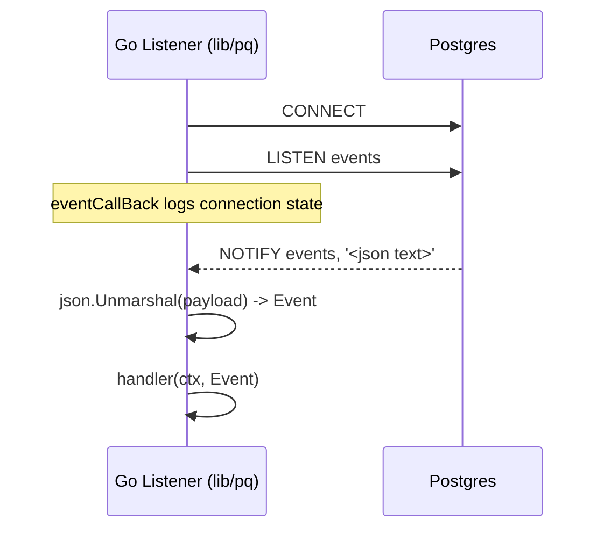
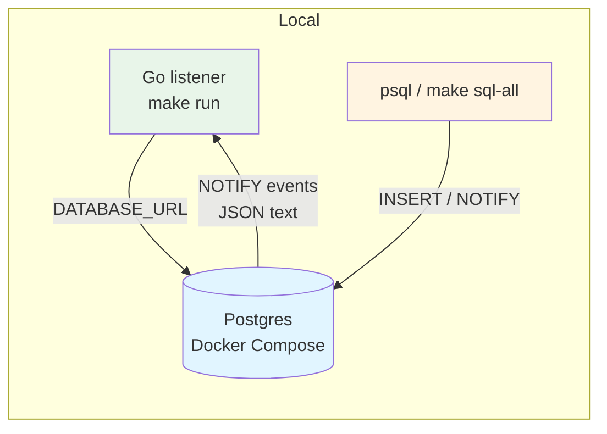

# gossippg — a Postgres LISTEN/NOTIFY listener in Go

> A tiny Go implementation listener for Postgres `LISTEN/NOTIFY`, which decodes JSON payloads and dispatches them to a handler and we can consume them from any client using that JSON payloads.

----

## Overview

This project connects to Postgres, `LISTEN`s on a channel (default: `events`), and processes notifications whose payload is JSON:

```json
{ "type": "post.created", "id": "…", "data": { ... } }
```

Example payload you’ll see after running `make seed` (values will differ):

```json
{
  "type": "post.created",
  "id": "3b8e4e9f-1c23-4a3a-a6b7-9c8d7e6f5a41",
  "data": {
    "id": "3b8e4e9f-1c23-4a3a-a6b7-9c8d7e6f5a41",
    "user_id": "0f7a9a8b-6c5d-4e3f-2a1b-0c9d8e7f6a54",
    "title": "Hello World",
    "body": { "text": "First post body" },
    "created_at": "2026-01-29T00:00:00Z"
  }
}
```

It also ships a minimal SQL schema + triggers that emit these notifications automatically on inserts.

## How It Works

Postgres `NOTIFY` can only send a **text** payload. To still send structured data, this project sends **JSON-as-text**:

- The SQL triggers call `pg_notify('events', jsonb_build_object(...)::text)`. That means Postgres is literally pushing a JSON string over the notification channel.
- On the Go side, lib/pq keeps a long-lived connection open and `LISTEN`s on the channel (default `events`). It also reports connection state changes (connected/disconnected/reconnected) via the listener callback, which we log.
- When a notification arrives, lib/pq delivers it on `pl.Notify`. We take `n.Extra` (the string payload), decode it into an `Event`, and keep `Event.Data` as **raw JSON bytes** (`json.RawMessage`) so the original JSON shape is preserved.
- Finally, the handler (`internal/handler.Log`) prints `data` as a JSON string (instead of Go’s `map[...]` format), so what you see in logs matches what was actually sent.



## Architecture (Local Dev)



## Project Layout

- **`cmd/main.go`**: wiring + graceful shutdown (SIGINT/SIGTERM)
- **`internal/config`**: reads `DATABASE_URL` and `PG_CHANNEL`
- **`internal/listener`**: lib/pq listener + JSON decode + handler dispatch
- **`internal/handler`**: example handler (`handler.Log`)
- **`sql/migrations`**: schema + triggers (`pg_notify`)
- **`sql/test`**: seed + manual notify scripts

## Setup (Recommended)

### 1) Start Postgres with Docker

```bash
make docker-up
```

### 2) Configure env

```bash
cp env.example .env
```

`env.example` is set up to match `docker-compose.yml` defaults.

### 3) Apply schema + triggers

```bash
make migrate
```

### 4) Run the listener

```bash
make run
```

### 5) Fire test events

```bash
make sql-all
```
